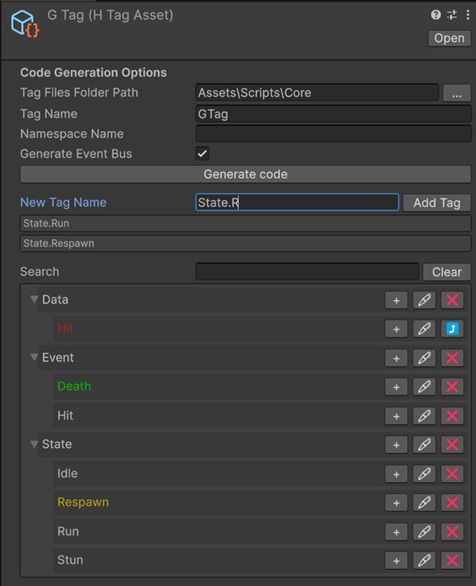

# EB Hierarchical Tags


A robust hierarchical tag system for Unity that offers fast comparisons, an asset-based hierarchical event bus, and strongly-typed code generation. Ideal for complex game logic requiring categorized identifiers with inheritance support.

## Key Features

- **Hierarchical Structure**: Organize tags in a tree-like parent-child relationship (e.g., `Damage.Fire`, `Damage.Water.Ice`).
- **Fast Comparisons**: Optimized tag checks to determine if a tag belongs to a parent category or matches exactly.
- **Strongly-Typed Tags**: Automated C# code generation provides type-safe tag references, sets, fields, and event buses.
- **Hierarchical Event Bus (Asset-based)**: Subscribe to a parent tag via a `ScriptableObject` event bus asset and receive events triggered by any of its children.
- **DOTS Compatible**: Uses `NativeArray` and blittable structs, making it suitable for high-performance ECS workflows.
- **Advanced Inspector**: Intuitive dropdown-based tag selection with search and hierarchy visualization.

## Installation

1. Open the Unity Package Manager (`Window > Package Manager`).
2. Click the `+` icon and select `Add package from git URL...`.
3. Enter the repository URL.
    - For the latest version:
      `https://github.com/EdwardBrave/htags.git`.
    - For a specific version (replace `v*.*.*` with the desired version):
      `https://github.com/EdwardBrave/htags.git#v*.*.*`

## Core Concepts

### HTagAsset
The central registry where you define and organize your tag hierarchy. It serves as the source for code generation, holds the list of registered tag `ScriptableObject`s, and optionally references an event bus asset.



### BaseHTagSo (generated as `{TagName}So`)
A `ScriptableObject` that represents a single tag instance and exposes the corresponding strongly-typed `{TagName}` struct via its `Tag` property. Each entry in the `HTagAsset` is backed by such an asset stored under the configured tags folder.

### {TagName} Struct
A generated, lightweight struct representing a specific tag. It carries hierarchy information (`HierarchyIDs`, a `NativeArray<int>` of all parent IDs), allowing for extremely fast relationship checks via `Equals` / `==` / `!=`. All registered tags are exposed as `public static readonly` fields and through `{TagName}.RegisteredTags` / `RegisteredTagsNames`.

### {TagName}Set Struct
A collection of tags optimized for bulk operations. It can efficiently check whether it contains a specific tag (`Has`), the exact tag without children (`HasExact`), or another full set, and supports adding/removing both individual tags and other sets.

### {TagName}SetField
A `[Serializable]` field type (deriving from `BaseHTagSetField`) used to expose a multi-tag selection in the Inspector. It lazily builds an internal `{TagName}Set` from the serialized `{TagName}So[]` array.

### {TagName}EventBusAsset (optional)
A `ScriptableObject` (deriving from `BaseHTagEventBusAsset`) that owns three hierarchical event buses:
- `eventBus` — `Action` listeners
- `floatEventBus` — `Action<float>` listeners
- `argsEventBus` — `Action<EventArgs>` listeners

When you `Raise` an event for a tag, all listeners registered on that tag *and* on any of its parents are invoked (from parent to child), thanks to the hierarchy information stored in the tag.

### {TagName}EventBusDispatcher (optional)
A generated `MonoBehaviour` that wires a tag and an event bus asset to `UnityEvent` / `UnityEvent<float>` callbacks, allowing event subscription and raising to be configured entirely from the Inspector.

## Getting Started

### 1. Define Your Tags
1. Create a new `HTagAsset`: `Right Click in Project > Create > HTag > HTagAsset`.
2. In the Inspector, add your tags using the **Hierarchical tags list**. Use dots to define nesting (e.g., `Status.Stun`, `Status.Poison`).
3. The system will automatically create individual `BaseHTagSo`-derived tag assets in the configured folder.

### 2. Generate Code
In the `HTagAsset` inspector, configure the **Code Generation Options**:

| Field | Description |
| --- | --- |
| `tagFilesFolderPath` | Folder where generated `.cs` files (and tag SO assets) are written. Defaults to the `HTagAsset` folder when empty. |
| `tagName` | Class/struct name prefix used for all generated types (e.g., `GameTag`). Defaults to the asset name when empty. |
| `namespaceName` | Optional namespace for the generated code. |
| `generateEventBus` | When enabled, additionally generates `{TagName}EventBusAsset` and `{TagName}EventBusDispatcher`. |

Trigger generation from the inspector. The generator produces:

- `{TagName}So.cs` — contains `{TagName}So`, `{TagName}SetField`, `{TagName}` struct, and `{TagName}Set` struct.
- `{TagName}EventBusAsset.cs` *(if `generateEventBus` is true)* — contains `{TagName}EventBusAsset`, `{TagName}EventBus`, and the generic `{TagName}EventBus<TArgs>`.
- `{TagName}EventBusDispatcher.cs` *(if `generateEventBus` is true)* — the `MonoBehaviour` dispatcher.

If `generateEventBus` is enabled, create a matching `{TagName}EventBusAsset` via the asset menu and assign it to the `HTagAsset.eventBusAsset` field.

### 3. Use in Scripts

Expose tag selection by serializing the generated `{TagName}So` (single tag) or `{TagName}SetField` (multiple tags):

```csharp
using UnityEngine;
using MyGame.Tags; // Namespace you defined

public class DamageReceiver : MonoBehaviour
{
    [SerializeField] private GameTagEventBusAsset eventBusAsset;
    [SerializeField] private GameTagSo resistanceTag;

    private void OnEnable()
    {
        // Subscribe to events for this specific tag or any of its parents
        eventBusAsset.AddListener(resistanceTag.Tag, OnResistedEffect);
        eventBusAsset.AddListener(resistanceTag.Tag, OnResistedEffectFloat);
    }

    private void OnDisable()
    {
        eventBusAsset.RemoveListener(resistanceTag.Tag, OnResistedEffect);
        eventBusAsset.RemoveListener(resistanceTag.Tag, OnResistedEffectFloat);
    }

    private void OnResistedEffect()
    {
        Debug.Log($"Resisted {resistanceTag} damage!");
    }

    private void OnResistedEffectFloat(float amount)
    {
        Debug.Log($"Resisted {amount} of {resistanceTag} damage!");
    }
}
```

### 4. Raising Events

```csharp
// Raising an event for 'Status.Poison' will also notify 'Status' listeners
eventBusAsset.Raise(GameTag.Status_Poison);
eventBusAsset.Raise(GameTag.Status_Poison, 12.5f);
eventBusAsset.Raise(GameTag.Status_Poison, EventArgs.Empty);
```

You can also drop a `{TagName}EventBusDispatcher` component on a `GameObject` to raise and react to events from the Inspector via `UnityEvent`s, with no extra code.

### 5. Working with Tag Sets

```csharp
using var damageTypes = new GameTagSet(GameTag.Damage_Fire, GameTag.Damage_Water_Ice);

if (damageTypes.Has(GameTag.Damage))        // true — any descendant of Damage
{
    // ...
}

if (damageTypes.HasExact(GameTag.Damage))   // false — no exact `Damage` tag
{
    // ...
}
```

## Technical Details

- **Minimum Unity Version**: 2022.3
- **Dependencies**: None.
- **Memory Management**: The generated `{TagName}` and `{TagName}Set` structs use `NativeArray` with `Allocator.Persistent`.
  - **Static Tags**: The tags exposed as `public static readonly` on the generated class (e.g., `GameTag.Status_Poison`) live for the lifetime of the application.
  - **Manual Creation**: If you create tags or sets manually via constructors, call `.Dispose()` to release the native memory.
  - `{TagName}SetField` disposes its internal set in `OnDestroy`.

## License

Developed by [Edward Brave](https://www.youtube.com/@EdwardBrave).
License: MIT.
